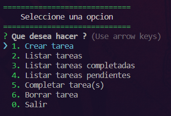
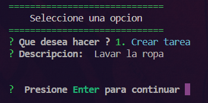
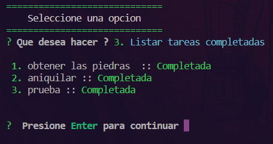
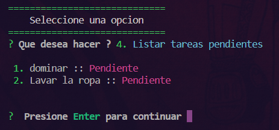
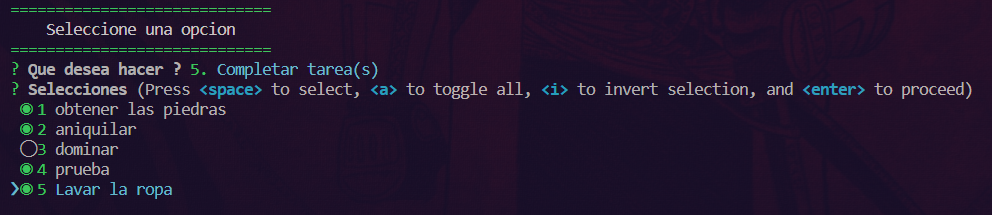
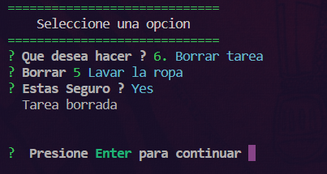
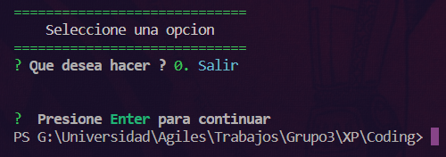

# Manual de Usuario

## 1. Introducción

La lista de tareas o To Do List es una aplicación diseñada para llevar el control de las tareas o actividades pertenecientes a una persona. Para esto, contiene un menú principal que permite realizar una actividad específica dependiendo lo que desee el usuario y almacena dicha información de manera que la información y las acciones realizadas sean persistentes.

Es importante considerar que, al ser un programa en consola y está escritp en JavaScript, para poder ejecutar el programa primero se necesita instalar los paquetes pertenecientes al manejador de paquetes de Node. Esto se lo realiza con el siguiente comando:

* npm i

Finalmente, para inicial el programa se debe ingresar el siguiente comando:

* npm start

## 2. Menú Principal

El programa tiene un único menú que presenta todas las actividades deseadas por el usuario, que son: crear tarea, listar tareas, listar tareas completadas, listar tareas pendientes, completar tarea(s), borrar tarea y salir. Para poder navegar a través de cada una de estas actividades basta mover con las flechas del teclado hasta la opción deseada, o a su vez, utilizar la parte numérica del teclado para desplazarse a la tarea deseada. Finalmente, para poder acceder a la funcionalidad específica basta con presionar la tecla enter.

   
  1. Menú principal.

## 3. Funcionalidades

### 3.1 Crear tarea

Al ingresar en esta opción, automáticamente se presentará nuevo contenido en consola que solicita el ingreso de la descripción de la tarea. Una vez escrita la tarea que se desea hacer, se debe presionar la tecla enter. Inmediatamente, se presentará un mensaje para continuar el cual requiere nuevamente que se presione enter. Finalmente, la tarea se ingresará y se almacenará junto con el resto de tareas, considerando que al ser una nueva tarea su estado se establecerá como pendiente.

   
  2. Crear tarea.

### 3.2 Listar tareas

Al ingresar en esta opción, se desplegará una lista completa, enumerada y ordenada con todas las tareas existentes que se han ido agregando a lo largo de su tiempo de uso. Adicionalmente, en esta pantalla se puede evidenciar el uso de estados (completado o pendiente) para todas las tareas correspondientemente. Para salir de esta pantalla, se debe presionar la tecla enter.

   
  3. Listar tarea.

### 3.3 Listar tareas completadas

Al ingresar en esta opción, se presenta una lista completa, enumerada y ordenada de todas las tareas existentes más aún, solamente se podrán observar aquellas que tengan el estado de completado. Para salir de esta pantalla, se debe presionar la tecla enter.

   
  4. Listar tareas completadas.

### 3.4 Listar tareas pendientes

Al ingresar en esta opción, se presenta una lista completa, enumerada y ordenada de todas las tareas existentes más aún, solamente se podrán observar aquellas que tengan el estado de pendiente. Para salir de esta pantalla, se debe presionar la tecla enter.

   
  5. Listar tareas pendientes.

### 3.5 Completar tarea(s)

Al ingresar en esta opción, se desplegará una lista con todas las tareas existentes. Adicionalmente, en la parte izquierda de cada una de estas se puede observar un elemento de marcado vacío o con un círculo. Este elemento adicional sirven para indicar el estado de las tareas, es decir, si se han completado (círculo de color verde) y o si están pendientes (vacío).  Para cambiar el estado de una tarea, es necesario desplazarse hasta la tarea deseada mediante las flechas del teclado y presionar la tecla espacio. Así también, en la parte superior a la lista de tareas se presenta dos de acciones adicionales que puede realizar que son: presionar "a" para marcar o desmarcar todas las tareas y presionar "i" para invertir el estado de las tareas (las completadas se cambian a pendientes y las pendientes a completadas). Finalmente, cuando se hayan realizado los cambios o se desee salir, se debe presionar la tecla enter.

   
  6. Completar tarea.

### 3.6 Borrar tarea

Al ingresar en esta opción, se desplegará una lista con todas las tareas existentes. Para borrar una tarea es necesario desplazarse por la lista mediante las flechas del teclado y presionar la tecla enter. En caso de no querer borrar alguna tarea, la primera opción presentada es "Cancelar" que al seleccionarla permitirá volver al menú principal. En caso de haber seleccionado una tarea para borrar, se presentará un mensaje de seguridad para verificar si realmente desea realizar la acción, de ser el caso debe escribir la letra "y", caso contrario debe escribir la letra "n". Finalmente, para completar la acción se debe presionar la tecla enter para.

   
  7. Borrar tarea.

### 3.7 Salir

Como apartado final se tiene la opción de Salir, mediante la cual el usuario podrá finalizar la ejecución y a su vez cerrar programa.

   
  6. Salir.

