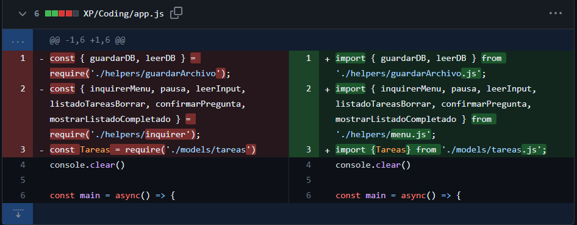
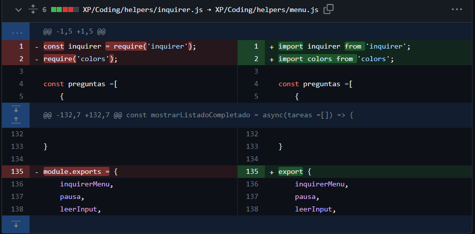
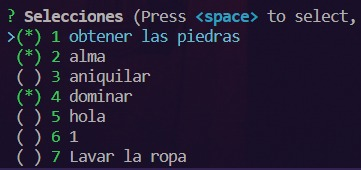
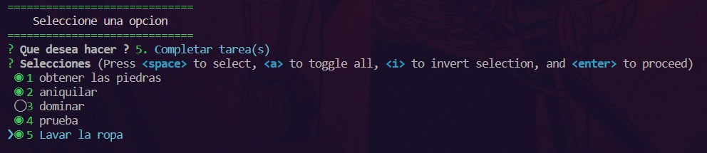

# Refactorización
### Cambios realizados en el código
#### Capturas

   
  1. Cambio 01.

   
  2. Cambio 02.

### Ejemplo de los Resultados
#### Capturas

   
  3. Antes de la refactorización.

   
  4. Despues de la refactorización.

