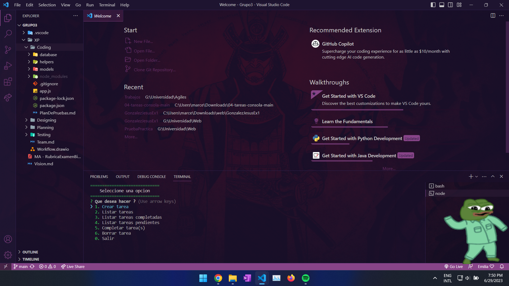
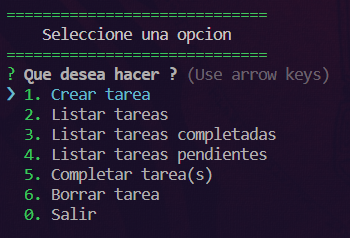
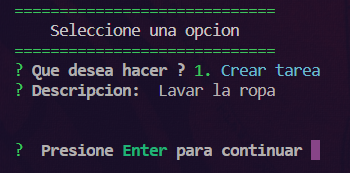
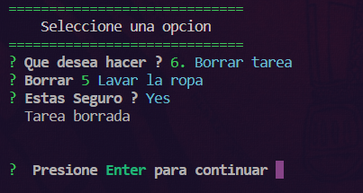
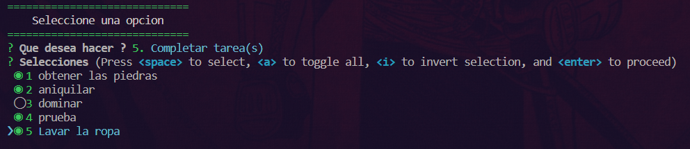
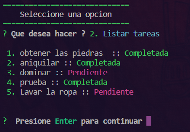
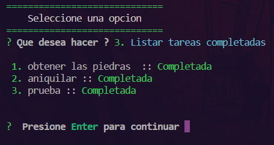
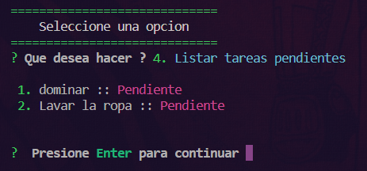

# Criterios de aceptación
### Criterio 01: Como usuario, quiero poder ejecutar el programa en mi consola para acceder a las funcionalidades.
#### Resultado
- Aceptado
#### Captura

   
  1. Criterio 01.

### Criterio 02: Como usuario, deseo que el programa tenga interfaz en consola que sea intuitiva y fácil de usar.
#### Resultado
- Aceptado
#### Captura

   
  2. Criterio 02.

### Criterio 03: Como usuario, quiero tener la capacidad de agregar nuevas tareas a mi lista.
#### Resultado
- Aceptado
#### Captura

   
  3. Criterio 03.

### Criterio 04: Como usuario, deseo poder eliminar tareas de la lista sin importar el estado en que se encuentre (completado o pendiente).
#### Resultado
- Aceptado
#### Captura

   
  4. Criterio 04.

### Criterio 05: Como usuario, deseo poder marcar una tarea como completada para indicar que he terminado de hacerla.
#### Resultado
- Aceptado
#### Captura

   
  5. Criterio 05.

### Criterio 06: Como usuario, deseo poder ver todas mis tareas de forma clara en la consola.
#### Resultado
- Aceptado
#### Captura

   
  6. Criterio 06.

### Criterio 07: Como usuario, quiero poder filtrar mis tareas según su estado (pendiente o completada) para visualizar solo las que me interesen en un momento dado.
#### Resultado
- Aceptado
#### Captura

   
  7. Criterio 07.

   
  8. Criterio 07.

