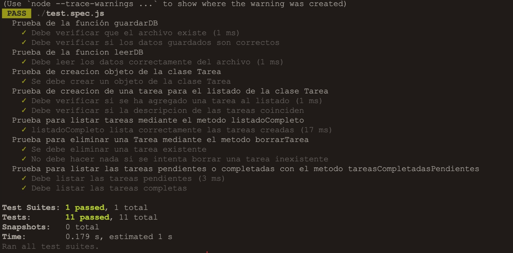

# Pruebas Unitarias
## Prueba Unitaria 01: -Validar que el programa guarde correctamente datos en el archivo.
### Resultado
- Aceptado
#### Captura

  

## Prueba Unitaria 02: -Validar que el programa lea correctamente datos en el archivo.
### Resultado
- Aceptado
#### Captura

  

## Prueba Unitaria 03: -Validar que el programa cree un objeto de la clase Tarea
### Resultado
- Aceptado
#### Captura

  

